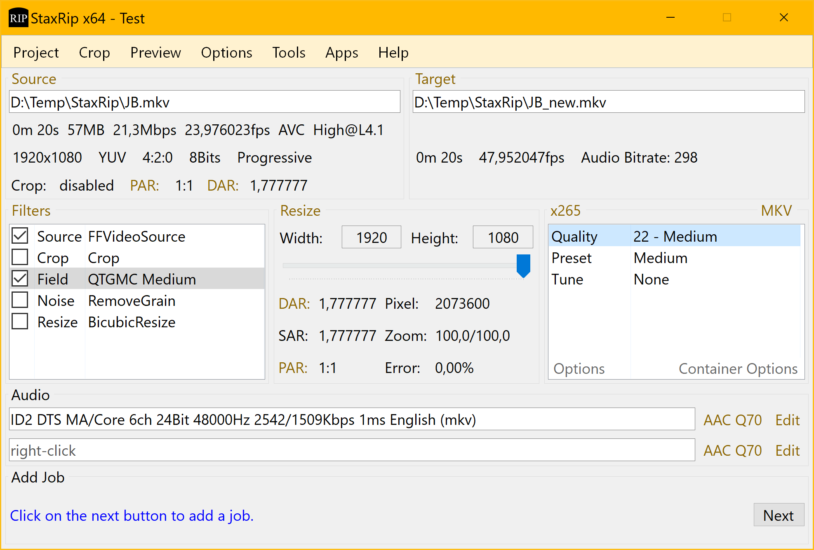
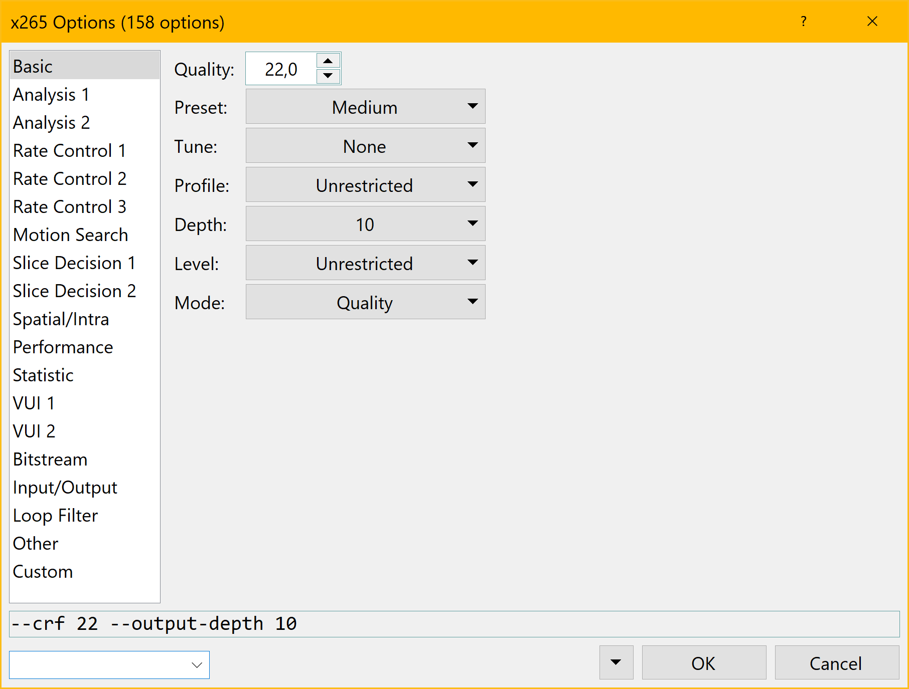
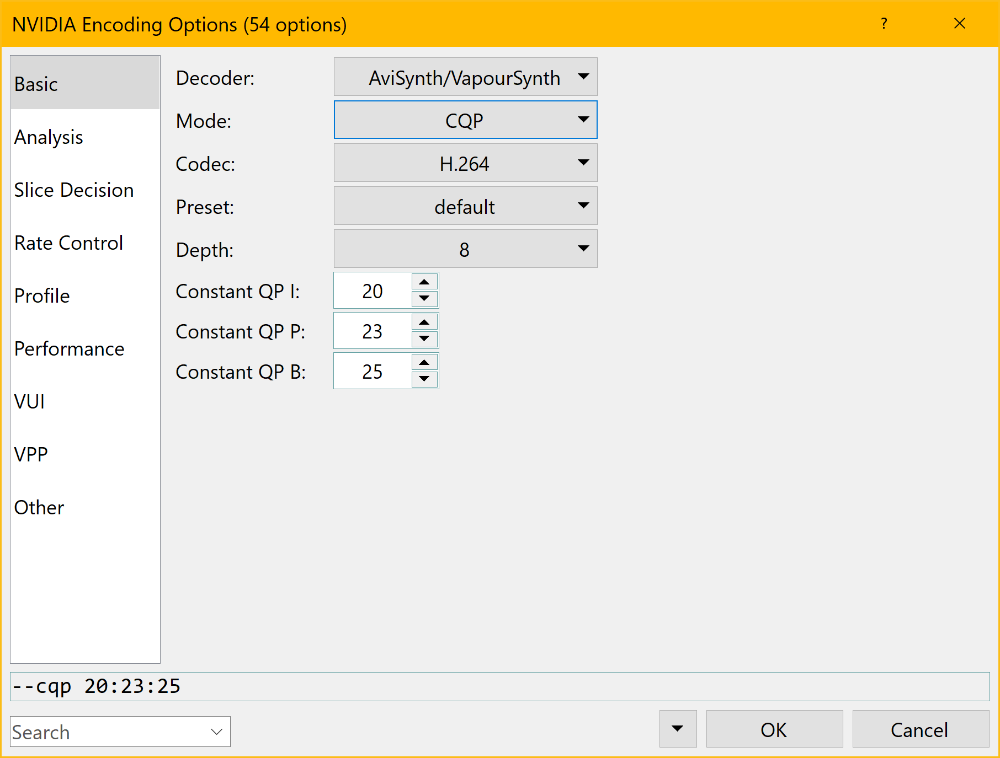
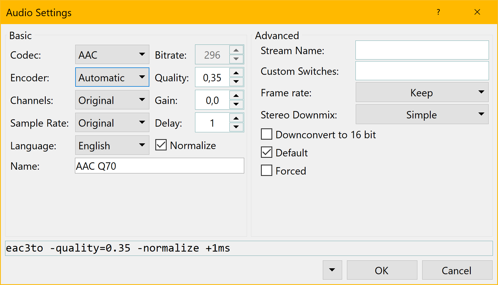

# About

staxrip is a multiformat video encoding application for Windows. It's a GUI frontend to processing tools such as mp4box, mkvtoolnix, avisynth, vapoursynth, x264, x265, nvenc, eac3to and many more.

## Features

- Supports all popular formats and tools
- Hardware encoding for AMD, Intel and NVIDIA
- Batch Processing
- AviSynth and VapourSynth code editor
- Extendable via PowerShell, .NET and COM+
- Minimal user interaction required due to rich configuration and automation features
- copy modes for audio and video for plain remuxing
- Cut/Trim/Edit feature, for MKV output no re-encoding required
- Aiming for perfect High DPI scaling 

## Requirements

- Windows 7 x64 or Windows 10 x64
- [.NET 4.7 or higher](https://www.microsoft.com/en-us/download/details.aspx?id=49981)
- [Intel Skylake](https://en.wikipedia.org/wiki/Skylake_%28microarchitecture%29) or newer for HEVC/H.265 hardware encoding
- [NVIDIA Maxwell gen2 card](https://en.wikipedia.org/wiki/Maxwell_%28microarchitecture%29#Second_generation_Maxwell_.28GM20x.29) or newer for HEVC/H.265 hardware encoding
- [AMD Polaris card](http://www.amd.com/en-gb/innovations/software-technologies/radeon-polaris) or newer for HEVC/H.265 hardware encoding
- AviSynth+ x64, the installer is bundled with StaxRip x64 or alternativly VapourSynth x64 which requires Python x64

## License

Licensed under the [MIT license](LICENSE.TXT).

## Download

https://github.com/stax76/staxrip/releases

https://github.com/stax76/staxrip/blob/master/md/test-build.md

## Support

For bug reports and feature requests please use the issue tracker:

https://github.com/stax76/staxrip/issues

I also provide help in various forums that can be found at:

Main Menu > Help > Support Forum

Most of the time I need a full log file which you can publish at www.pastebin.com, enable auto expire after 30 days.

Screenshots are also often useful, there are many free and easy to use hosting services like https://postimage.io/

## Screenshots

### Main Window

[](https://github.com/stax76/staxrip/blob/master/Screenshots/1.png)

### x265 Encoder Options

[](https://github.com/stax76/staxrip/blob/master/Screenshots/2.png)

### NVIDIA Encoder Options

[](https://github.com/stax76/staxrip/blob/master/Screenshots/3.png)

### Audio Encoding Options

[](https://github.com/stax76/staxrip/blob/master/Screenshots/4.png)

# Documentation

## Setup

StaxRip is for the most part portable, some features require certain apps to be installed, in such case StaxRip provides guidance so the user must not take great care.

Whenever StaxRip starts the first time from a new location it will ask for a settings folder location to use for this particular start-up location. You can open the current settings folder from the main menu at Tools > Directories > Settings

It's not recommended to start StaxRip from a location without full write access so 'C:\Program Files' shouldn't be used. StaxRip utilizes dozens of tools and some of this tools might require write access to their start-up directory.

To add StaxRip to the windows start menu use the context menu of the windows file explorer.

## AviSynth and VapourSynth scripting

StaxRip uses AviSynth x64 and VapourSynth x64 for video processing and includes many x64 plugins, 32-bit/x86 plugins are not compatible.

## Command Engine

StaxRip uses a command engine for the following features:

- StaxRip's command line interface (documented at: Main Menu > Help > Command Line)
- StaxRip's configurable main menu and various other menus
- StaxRip's Event Command Feature (located at: Main Menu > Tools > Advanced > Event Commands)

The Event Command feature allows to run commands on defined events under defined conditions.

A interesting command is -Perform-ExecuteBatchScript

It executes a batch script with solved macros. Macros are also available as environment variables. Executables started by the batch script inherit the access to these environment variables.

The 'Execute Batch Script' command has a option 'Interpret Output' that can be turned on to interpret each console output line from the batch script or executables started in the batch script as StaxRip command. The documentation of the StaxRip commands is located at: Main Menu > Help > Command Line.

Used executables can be powershell.exe, cscript.exe (VBScript/JScript), python.exe, any other scripting engine or any console app programed in any programming language.

## Scripting

StaxRip can be automated via PowerShell scripting. There are two example scripts included, they can be found at:

Main Menu > Tools > Scripts > Open Scripts Folder

### Scripting Events

In order to run scripts on certain events read the help at:

Main Menu > Help > Scripting

### Scripting Support

If you have questions feel free to ask here: https://github.com/stax76/staxrip/issues/200

### Scripting Examples

Sets a deinterlace filter if the MediaInfo property 'ScanType' returns 'Interlaced':

```
# active project
$p = [ShortcutModule]::p

#global object with miscelenius stuff
$g = [ShortcutModule]::g

if ([MediaInfo]::GetVideo($p.FirstOriginalSourceFile, "ScanType") -eq "Interlaced")
{
    $p.Script.SetFilter("yadifmod2", "Field", "yadifmod2()")
}
```